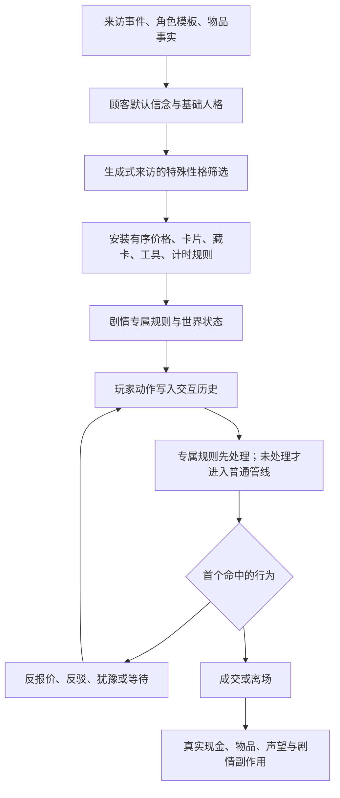

# 两份 Demo 的原文件研究总册

研究日期：2026-09-21。范围由用户确认：`原文件`里的 Windows **1.0.5 Demo** 与 Mac **0.2.5 (Demo)**。两份包分别解析，不把旧版数据填进新版，也不把打包的后期资源等同于 Demo 能完整游玩的流程。

这次已建立可追溯的全量物品、卡片、手册、工具和交易事件目录，并直接调用原程序集检查规则。**这是一套原系统研究资料，不是“现有网页游戏已经全部实现”的验收声明。** 现有实现与原程序的差异已经实际测出。

## 从这里阅读

| 想了解什么 | 可读报告 | 可查询的数据 |
|---|---|---|
| 每件物品、每张卡、工具操作、完整书页 | [物品与鉴定](ITEMS_TOOLS.md) | [全部字段与工具读数](item-tool-catalog.json)、[工具及估值规则](tool-rule-spec.json) |
| NPC 如何报价、接受、反驳、藏卡、离场 | [NPC 议价模型](NPC_MODELS.md) | [人格与特殊管线](npc-models.json)、[逐个事件](../../reference/original-study/npc/event-models-windows-1.0.5-demo.json) |
| 顾客生成、跨日、贷款、租赁、拍卖、维修和剧情后果 | [经营与剧情](PROGRESSION.md) | [调度目录](progression-catalog.json)、[带条件的动作图](../../reference/original-study/progression/semantic-actions-windows-1.0.5-demo.json) |
| 现有复刻具体差在哪里 | [物品/工具缺口](item-tool-parity-gaps.json) | [议价差异](npc-parity-gaps.json)、[经营差异](progression-parity-gaps.json) |
| 如何复核本次研究 | [综合核验](RESEARCH_VERIFICATION.json) | [物品核验](../../reference/original-study/items/validation-report.json)、[剧情核验](../../reference/original-study/progression/verification.json) |

方便逐条查数值的文件：[Windows 物品表](items-windows-1.0.5-demo.csv)、[Windows 卡片表](cards-windows-1.0.5-demo.csv)、[Mac 物品表](items-mac-0.2.5-demo.csv)、[Mac 卡片表](cards-mac-0.2.5-demo.csv)。

完整手册正文和页面条件：[Windows 77 页](manual-windows-1.0.5-demo.md)、[Mac 73 页](manual-mac-0.2.5-demo.md)。正文可拖卡链接也已解析，不只是固定按钮和图片。

## 目录覆盖到什么程度

| 对象 | Windows 1.0.5 Demo | Mac 0.2.5 Demo |
|---|---:|---:|
| Item 原始定义 | 609 | 388 |
| 通过原加载器检查的物品 | 609 | 387 |
| 允许随机生成的物品定义 | 398 | 275 |
| Card 原始定义 | 252 | 228 |
| 配置手册页 | 77 | 73 |
| 全书可拖出的不同卡 ID | 143 | 135 |
| StoreEvent 交易/来访事件 | 517 | 284 |
| 有有效脚本指针且已完整解码的组件 | 74,752 | 40,132 |

Mac 的 `BSC_acc_02` 含空卡指针，原 `Item.LoadItems` 会排除它，因此保留 388 条原始记录与 387 条可加载记录两个口径。每个物品均有六种工具的适用性和来源字段；“没有签名图”与“未知读数”分开记录。

两份包共有 132 个原本脚本指针为零的组件，保留其位置和读取失败记录，没有补造类定义。两个 Windows 遗留文本表的 sharedData 指针也为零，正文已保留而键名不猜测。这些与正常玩法数据分别计数。

## 数值不是从说明文字抄出来的

卡面文字、资源字段、原生工厂创建结果、最终估值是四层证据。它们有时并不相同。每张卡都保留类别、tier、颜色、显示文字、实际函数采样和工厂路径；每件物品保留静态卡、精炼后的卡、真实字段与原 DLL 返回值。

已执行的主要核对：

- Windows 全部 **609 × 252 = 153,468** 个物品与卡片组合，直接调用原 `isReallyTrueCard`。
- Windows **1,616** 个损伤与申报状态组合，检查重叠容差及边界。
- 两版全部可加载物品的估值、所有卡各七个输入值、卡片工厂创建入口，以及各 **144** 个宝石组合。
- Mac 旧鉴定链另做 **387 × 228 × 2 = 176,472** 次真值调用、**1,616** 个损伤组合、**27** 个收购评价/结算边界及两条普通出售验证，详见[Mac 旧版鉴定与结算](MAC_LEGACY_APPRAISAL.md)。
- 两套独立解析器对 **77 + 73** 页手册逐字段交叉比对，完整消费原二进制；全部页面子对象、固定拖卡控件和正文拖卡链接均有引用核验。
- 交易部分直接调用五种人格的 **540** 个初价样本，另有报价序列、隐藏卡、特殊性格、销售和概率实验；详细范围见 NPC 报告。
- 剧情部分 **1,967** 个 Odin 二进制块重新解码，结果无差异；经营探针 **129** 条独立断言通过。它们不是“129 条完整剧情通关”。

原 DLL 在独立 .NET 7 探针进程中调用。确定性数值可作为函数对照；随机观测不能证明与原 Unity/Mono 进程使用相同的逐次随机序列，也不证明帧时序和场景回调完全一致。

几个会直接影响复刻的确认结果：

1. 非空卡列的核心估值至少为 **1**，保留 double；不能在这一层统一向下取整或截成零。
2. 两版宝石函数的价格都是“宝石基础值 × 切割系数”，**克拉不参与价格计算**。
3. `green_art_revalued` 卡面印 600，但已检查的原生路径不增加 600；Garnet 认证卡则存在静态卡效与工厂创建不同的情况。
4. Windows 工具有自动翻书、Shift 抑制、保留某些当前页等规则；Mac 六工具没有相同的自动翻页流程。宝石仪的私人槽限制也不同。
5. Windows Darcy 贷款为 **5%/天**，Mac 为 **2.5%/天**；不能将两个包合并成一张数值表。

## NPC 的心理模型如何组合

“NPC 的底价是物品价格的固定百分比”不足以重建原作。同一个人物模板，在不同事件与历史下可能拥有不同的信念卡、特殊脚本和报价管线。

五个基础人格枚举不等于五套完全独立算法：1.0.5 中 Emotional 共用 Active 价格流程，Cautious 共用 WishyWashy。特殊性格还要经过“是否有资格、概率筛选、随机排序、实际应用映射”几层；候选概率不等于最终出现概率。

每条事件都已关联物品、角色、默认信念、交易方向、基础人格适用性、专属 Hook，以及解码后的 Intro/Outro/CallableChunk。所有选项和真假分支保留原路径，不会把互斥奖励一起执行。逐事件目录包含 **801** 条记录，其中很多是叙事事件或求购，不能称作“801 种不同心理人格”。

已查明的行为包括：反价取整后与玩家价相同可直接成交；同样的重复报价会因历史阶段产生不同反应；部分顾客会等待 ticks 后回应；藏卡和使用工具也会触发反应；买家还有便宜价直接购买与多物品打包流程。详见 [NPC 模型](NPC_MODELS.md) 的逐管道顺序和公式。

## 当前网页原型必须重新对齐的部分

原型的自由路径与账目守恒测试仍有价值，但不能代表原作行为准确。本次用原 DLL 对照 **540** 条简化初价输入，现有实现有 **109** 条结果不同；这只是无特殊性格、无花、无计时等条件下的边界集，并不是全游戏差异率。

当前产品仍为 **31 个物品定义、21 页书图**的录像片段。源数据要求的范围更大：全书正文拖卡、动态物品与宝石、完整有序议价流程、租赁/拍卖、库存随世界变化，以及剧情回调。原 Challenge 也是 **30 次收购，加出售、街游和结算**；原型“30 次来访”不能算相同模式。

后续重建应按以下依赖顺序进行：

1. 以 1.0.5 的完整目录为数据源，分离真实属性、NPC 信念、玩家鉴定和动态实例。
2. 实现原始估值/覆盖顺序，并用原 DLL 输出作为外部对照。
3. 实现完整手册与六工具状态机，包括正文拖卡、解锁、Shift、工具动画中的输入限制。
4. 实现有顺序、能保存历史和计时状态的 NPC 管线，再接特殊事件规则。
5. 连接库存、经营服务、调度与剧情副作用；逐条恢复真实可达路径。
6. 最后做原场景与复刻的同输入运行对照及视觉验收，不能把数据抽取替代这一步。

## 本轮验证的边界

已完成全量数据枚举、原始文件完整性检查、关键计算函数调用与上述范围的行为实验。原文件中的 877 个 Data 文件重新核对 SHA-256 后均未改变；没有启动两份原游戏的原生可执行程序，没有改动现有产品 `src`。

尚未逐一实际运行所有原 Unity 场景、全部剧情条件组合、动画被打断的工具交互及随机序列；Mac 旧版已单独追到收购时的 precise 计数与 ID/Reference 真值规则；普通出售没有新版那条售后声誉评价链，不能套用 Windows 矩阵。两包从 New Game 的现存 Level 调度均止于 DAY3；后期脚本可供规则研究，但其存在不能证明 Demo 能游玩整部作品。

所以本轮结论是“原文件可查的数据与关键规则已形成完整目录和可复查证据”，而不是“所有原游戏行为已经无遗漏验证”或“复刻已完成”。

## 复现与定位

- 原包清单、逐文件哈希、版本信息、资源对象索引：`reference/original-study/<version>/`。优先用 `final-index.json`；初次提取报告保留了后来已修复的解析错误，不代表最终失败数。
- 原始对象身份是“序列化文件名:pathId”，不能跨文件只按数字匹配。程序集中的类型、函数、IL 偏移、常量和调用索引是该目录的 `il-*.json`。
- 提取器：[extract-original-data.py](../../scripts/research/extract-original-data.py)；兼容恢复：[recover-original-data.py](../../scripts/research/recover-original-data.py)；原生头部独立核对：[normalize-original-headers.py](../../scripts/research/normalize-original-headers.py)。旧 managed-reference 终止标志、字符串数组类型和脚本指针对齐都有明确修复，读取要求完整消费对象字节。
- 综合核验：在项目根目录执行 `python3 scripts/research/verify-original-study.py`。它检查源文件、目录覆盖、双解析一致性、探针覆盖和外部引用；不会把差异藏成“全部通过”。
- 依赖与版本：[research-environment.json](../../reference/original-study/research-environment.json)。具体探针源码和复跑入口位于 `reference/original-study/items/`、`npc/`、`progression/`。
